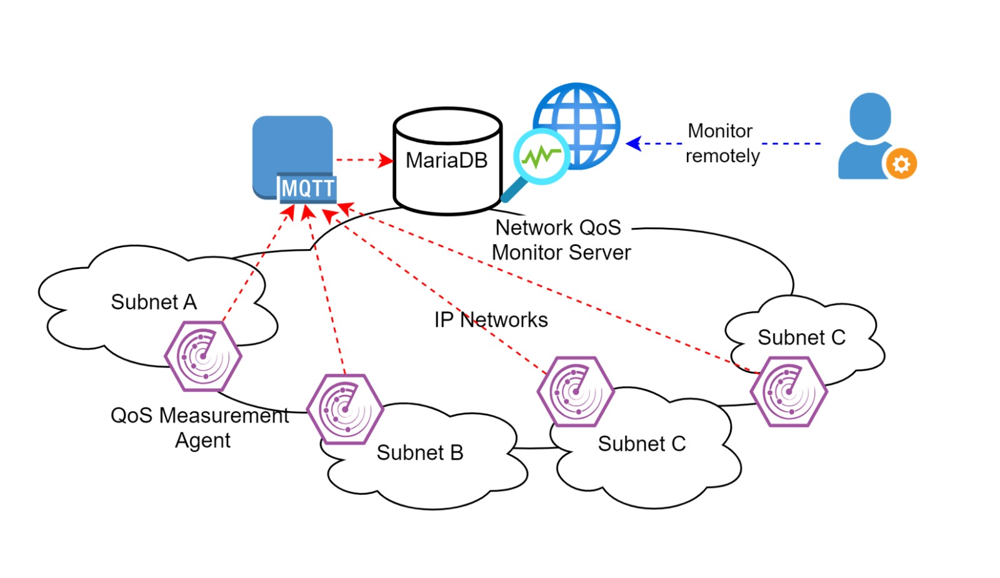

# 🌐 A Network QoS Monitor System on IP Networks

## Overview

A distributed Quality of Service (QoS) monitoring system developed during the IISMA Program at National Formosa University, Taiwan.

The system collects network performance metrics from Raspberry Pi monitoring nodes and provides real-time visibility through a centralized dashboard.

---
## Research Context

- Program: IISMA 2024
- Institution: National Formosa University, Taiwan
- Laboratory: IoT and Intelligent Cloud Application Laboratory
- Field: Network Engineering & IoT

---
## Problem

Traditional network monitoring often focuses on bandwidth utilization while overlooking other critical Quality of Service (QoS) metrics such as latency, jitter, and packet loss.

As a result, network issues may remain undetected despite seemingly stable bandwidth conditions.

---

## Solution

To address this issue, a distributed QoS monitoring architecture was developed using Raspberry Pi agents, MQTT communication, MariaDB storage, and a web-based analytics dashboard.

The platform continuously measures network performance and provides centralized visualization for administrators.

---

## Technologies Used

| Category | Technology |
|-----------|-----------|
| Hardware | Raspberry Pi 4 |
| Communication | MQTT |
| Database | MariaDB |
| Backend | Python, PHP |
| Frontend | HTML, CSS, JavaScript |
| Network Analysis | iPerf3 |

---

## My Contribution

My primary responsibilities included:

- Designing Jitter and Packet Loss measurement workflows
- Developing Raspberry Pi measurement agents
- Integrating MQTT-based data transmission
- Supporting dashboard visualization and data analysis
- Validating collected QoS metrics in laboratory environments

---

## System Architecture

The architecture consists of distributed Raspberry Pi monitoring nodes connected to a centralized monitoring server through MQTT communication.

---

## Dashboard Preview

### Real-Time Monitoring

The dashboard visualizes:

- Bandwidth
- Latency
- Jitter
- Packet Loss

---
## Key Findings

- Stable bandwidth does not always indicate good network quality.
- Latency and jitter significantly affect user experience.
- Distributed monitoring provides better visibility across multiple network segments.
- MQTT enables efficient real-time data transmission from remote nodes.

---
## Future Improvements

- SNMP integration
- Network anomaly detection
- Predictive analytics using machine learning
- Multi-site monitoring support
